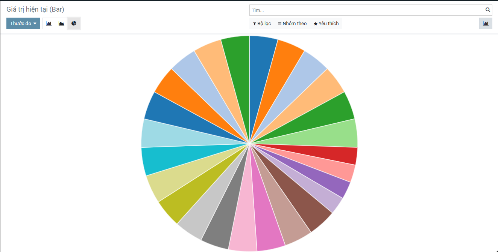
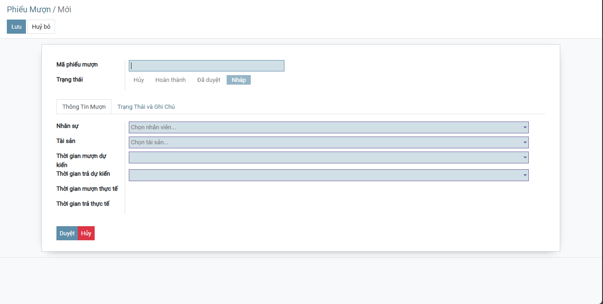
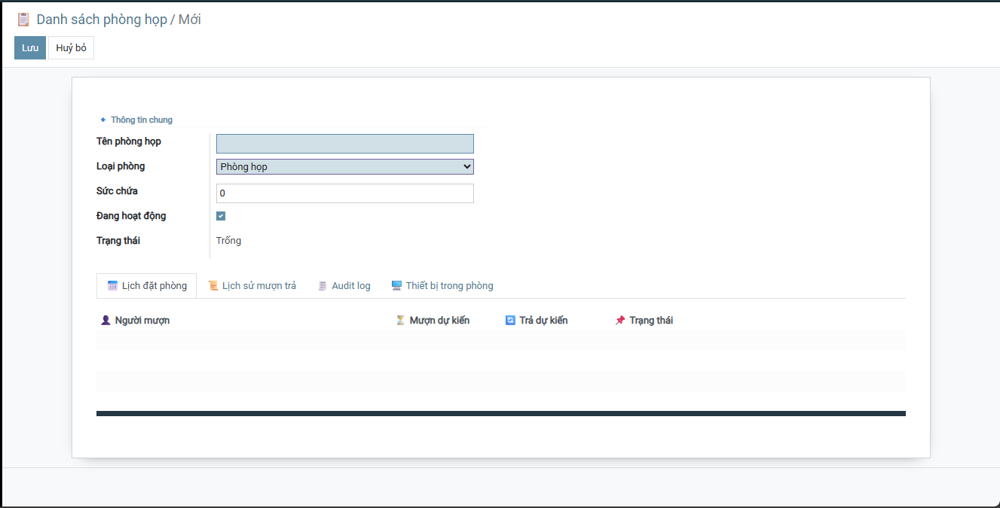
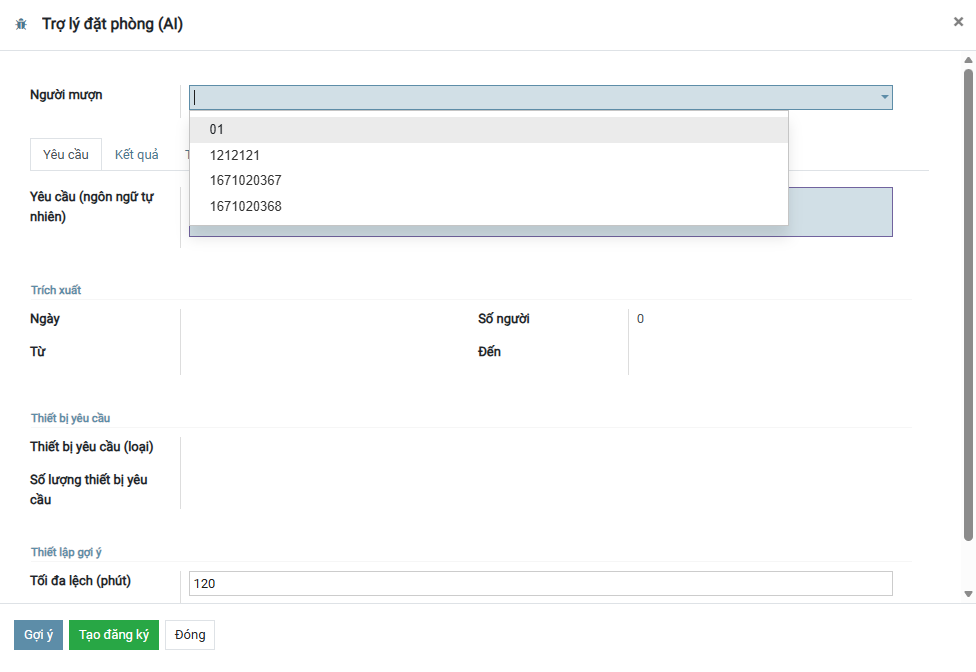
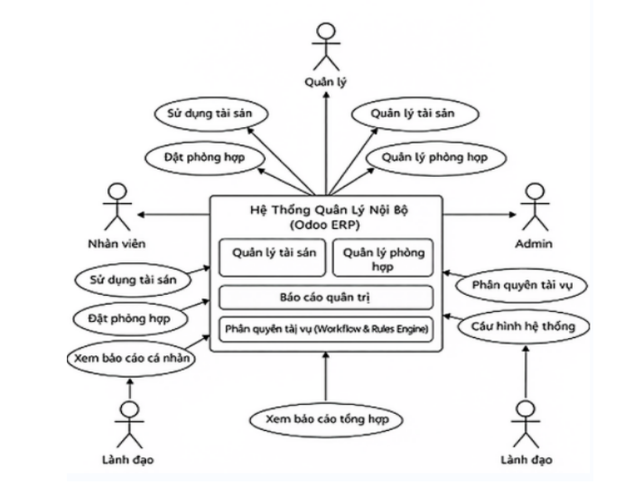
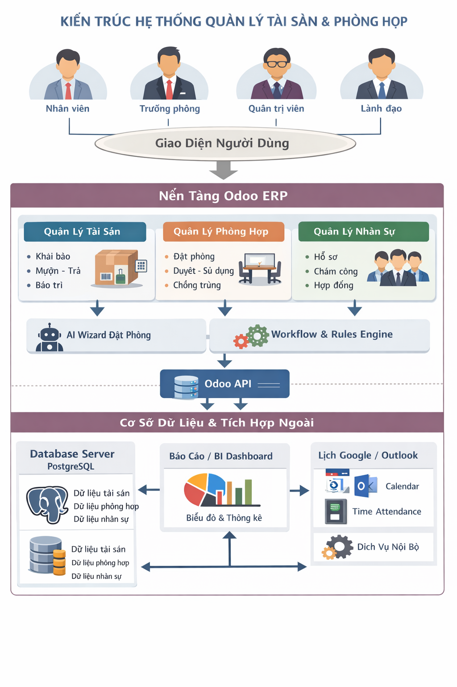

<h2 align="center">
  🎓 Trường Đại học Đại Nam – Khoa Công nghệ Thông tin
</h2>

<h2 align="center">
  Hệ thống Quản lý Tài sản & Phòng họp (Odoo ERP)
</h2>

<div align="center">
  <p align="center">
        
        
        
  </p>

  <!-- Badges (tuỳ chọn) -->
  
  
  
  
  

</div>

---

## 📖 1. Giới thiệu
Hệ thống được xây dựng để **quản lý tài sản** và **phòng họp** trong tổ chức trên nền tảng **Odoo ERP**,
nhằm chuẩn hóa quy trình vận hành nội bộ, giảm quản lý thủ công (Excel/nhóm chat), tăng minh bạch và truy vết.

**Bối cảnh triển khai (K16 kế thừa & cải tiến):**
- Nhóm K16 **kế thừa 02 module từ K15**:
  - Module quản lý tài sản (K15)
  - Module quản lý phòng họp (K15)
- Sau đó nhóm K16 tiến hành **cải tiến**: siết ràng buộc dữ liệu, chuẩn hóa workflow, chống trùng lịch, tăng audit/log,
bổ sung dashboard/thống kê và wizard hỗ trợ đặt phòng nhanh.

---

## ✅ 2. Các tính năng

### 2.1. Quản lý Tài sản
- Dashboard tổng quan tài sản theo: **loại / số lượng / giá trị / trạng thái**
- Quản lý danh mục: **loại tài sản**, **tài sản**
- Đăng ký mượn/cấp phát theo quy trình:
  **Tạo yêu cầu → Phê duyệt → Đang mượn → Trả/Thu hồi → Hủy**
- Bảo trì tài sản/thiết bị, cập nhật trạng thái
- Báo cáo & Audit: lịch sử mượn–trả, nhật ký thay đổi
- Nghiệp vụ nâng cao (mở rộng): **kiểm kê, điều chuyển, khấu hao, thanh lý**

### 2.2. Quản lý Phòng họp
- Dashboard phòng họp theo: **trống / đã duyệt / đang sử dụng**
- Quản lý danh mục phòng: sức chứa, trạng thái
- Quản lý thiết bị phòng họp (gắn phòng/kho)
- Đặt phòng theo thời gian + workflow:
  **Tạo yêu cầu → Phê duyệt → Sử dụng → Trả → Hủy**
- Chống trùng lịch phòng/thiết bị theo thời gian
- Báo cáo & Audit: lịch sử đặt phòng, nhật ký thao tác

### 2.3. Trợ lý AI đặt phòng (Wizard)
- Nhập yêu cầu tự nhiên (VD: “Họp 8 người, cần máy chiếu, 14:00–15:30”)
- Gợi ý phòng/thiết bị phù hợp
- Tạo đăng ký nhanh, giảm lỗi nhập liệu

---

## 🧰 3. Công nghệ và công cụ

### Hệ điều hành
- Ubuntu (WSL) / Linux / Windows

### Công nghệ chính
- **Odoo ERP** (khuyến nghị v15)
- **Python 3.10**
- **PostgreSQL 10**
- **Docker / Docker Compose**
- (Tuỳ chọn) Git/GitHub
<div align="center">
  <p align="center">
        
  </p>
</div>

## ⚙️ 4. Cài đặt

### 4.1. Yêu cầu tối thiểu
- CPU: 2 cores (khuyến nghị 4)
- RAM: 4GB (khuyến nghị 8GB)
- Disk trống: 20GB

### 4.2. Khởi tạo PostgreSQL bằng Docker
Tạo file `docker-compose.yml`:
```yaml
version: '3.8'
services:
  db:
    image: postgres:10
    container_name: odoo_db
    environment:
      - POSTGRES_DB=postgres
      - POSTGRES_USER=odoo
      - POSTGRES_PASSWORD=odoo
    ports:
      - "5431:5432"
    volumes:
      - odoo_db_data:/var/lib/postgresql/data
volumes:
  odoo_db_data:
```

Chạy DB:
```bash
docker compose up -d
docker ps
```

### 4.3. Tạo môi trường Python & cài dependencies
```bash
python3.10 -m venv venv
source venv/bin/activate
pip install --upgrade pip wheel setuptools
pip install -r requirements.txt
```

### 4.4. Cấu hình `odoo.conf`
Ví dụ:
```ini
[options]
admin_passwd = admin
db_host = localhost
db_port = 5431
db_user = odoo
db_password = odoo

addons_path = /path/to/odoo/addons,/path/to/custom_addons
data_dir = /home/<user>/.local/share/Odoo
xmlrpc_port = 8069
logfile = /path/to/odoo.log
```

### 4.5. Chạy hệ thống
```bash
source venv/bin/activate
python3 odoo/odoo-bin -c odoo.conf
```

Truy cập:
- http://localhost:8069

---

## 🧭 5. Hướng dẫn sử dụng

### 5.1. Cài đặt/Upgrade module
Vào **Apps** → tìm và **Install/Upgrade** các module:
- `tai_sanm` (K16) *(đổi đúng tên module nếu khác)*
- `phong_hopm` (K16) *(đổi đúng tên module nếu khác)*
- (Nếu có) `nhan_su`

### 5.2. Luồng sử dụng nhanh – Tài sản
1. Tạo **Loại tài sản** → tạo **Tài sản**
2. Tạo **Phiếu mượn** → phê duyệt → nhận tài sản
3. **Trả/Thu hồi** → kiểm tra trạng thái và lịch sử mượn–trả

### 5.3. Luồng sử dụng nhanh – Phòng họp
1. Tạo **Phòng họp** (sức chứa, trạng thái)
2. Tạo **Thiết bị** (gán kho/phòng)
3. Tạo **Đơn đặt phòng** → phê duyệt → bắt đầu sử dụng → trả phòng
4. Kiểm tra **chống trùng lịch** phòng và thiết bị

### 5.4. Sử dụng AI Wizard đặt phòng
1. Mở wizard → nhập yêu cầu tự nhiên
2. Nhận gợi ý phòng/thiết bị → tạo đơn nhanh
3. Kiểm tra đơn đặt được sinh đúng thời gian, phòng và thiết bị

---

## ⭐ 6. Các tính năng nổi bật (K16 so với K15)
- Chuẩn hóa workflow và điều kiện chuyển trạng thái (giảm thao tác sai)
- Tăng ràng buộc dữ liệu: thời gian hợp lệ, chống trùng lịch phòng/thiết bị
- Tăng audit/log để đối chiếu khi có tranh chấp
- Dashboard/biểu đồ thống kê (hỗ trợ quản trị nhanh)
- Wizard AI đặt phòng (tăng UX, giảm lỗi nhập liệu)
- Định hướng tích hợp (API/endpoint nếu dự án có)

---

## 🧩 7. Trường hợp sử dụng (Use cases)

### 7.1. Mượn laptop/máy chiếu cho công việc
- Nhân viên tạo phiếu mượn → quản lý duyệt → nhận tài sản → trả đúng hạn → hệ thống ghi lịch sử.

### 7.2. Đặt phòng họp có thiết bị
- Nhân viên tạo đơn đặt phòng theo khung giờ, chọn thiết bị → hệ thống kiểm tra trùng lịch → quản lý duyệt →
sử dụng → trả phòng/thiết bị.

### 7.3. Kiểm kê và thanh lý tài sản cũ
- Tạo đợt kiểm kê → cập nhật tình trạng → lập hồ sơ thanh lý → lưu lịch sử tài sản.

---

## 🖼️ 8. Screenshots (Minh hoạ giao diện)

> Gợi ý: tạo thư mục `docs/screenshots/` và đặt ảnh theo đúng tên file bên dưới để README tự hiển thị.

### 8.1. Dashboard Tài sản
  

### 8.2. Danh sách / Phiếu mượn tài sản
  

### 8.3. Đặt phòng + Trạng thái (workflow)
  

### 8.4. AI Wizard đặt phòng
- Ảnh gợi ý: `docs/screenshots/ai_wizard_datphong.png`

  

---

### 9. Sơ đồ hệ thống (Use case / Kiến trúc)
- Use case: 
- Kiến trúc hệ thống:
- **Use case diagram**

  

- **Kiến trúc hệ thống**

  

---

## 10. 🤝 Đóng góp (Contributing)
1. Fork/clone dự án
2. Tạo nhánh mới: 
3. Commit rõ ràng:
4. Tạo Pull Request kèm mô tả, ảnh minh hoạ

Gợi ý mở rộng:
- Phân quyền chi tiết theo vai trò (Admin/Quản lý tài sản/Điều phối phòng họp/Người dùng)
- Báo cáo KPI: tài sản quá hạn, phòng họp theo tuần/tháng, thiết bị sử dụng nhiều
- Tích hợp Google/Outlook Calendar và email nhắc lịch

---

## 11.  👥 Thông tin nhóm
- Nhóm: **Nhóm 10 – K16**
- Kế thừa: **K15** (Tài sản & Phòng họp)
- https://github.com/Duongbe/TTDN-15-05-N4/tree/master/addons/quan_ly_tai_san/models
- https://github.com/linhdang2k03/TTDN-15-05-N8/tree/nhom8/addons/quan_li_phong_hop_hoi_truong/models
- Cải tiến & triển khai: **K16**
- Thành viên: [Trần Chiến Thịnh, Nguyễn Trọng Anh, Nguyễn Thị Thùy Linh]

---

## 📝 12. Changelog (K15 → K16)

Nhóm K16 kế thừa 02 module (Tài sản, Phòng họp) từ K15 và thực hiện các cải tiến chính sau:

1. **Chuẩn hóa workflow và trạng thái xử lý** cho mượn/trả tài sản và đặt phòng (giảm thao tác sai quy trình).
2. **Bổ sung/siết ràng buộc dữ liệu**: kiểm tra thời gian hợp lệ, điều kiện chuyển trạng thái, hạn chế nhập thiếu/nhập sai.
3. **Tăng kiểm soát trùng lịch** phòng họp và (nếu áp dụng) thiết bị theo cùng khung thời gian.
4. **Cải thiện audit/truy vết**: nhật ký thay đổi, lịch sử mượn–trả/đặt phòng rõ ràng hơn.
5. **Bổ sung thống kê/dashboard** phục vụ quan sát nhanh tình trạng tài sản/phòng họp.
6. **Bổ sung AI Wizard đặt phòng**: nhập yêu cầu tự nhiên, gợi ý phòng/thiết bị và tạo đăng ký nhanh.
7. **Chuẩn hóa cấu trúc triển khai** để cài/upgrade ổn định trên môi trường Odoo + PostgreSQL Docker.


---

## 📄 13. License
**Educational Use** – Dự án phục vụ mục đích học tập trong học phần *Thực tập CNTT7 – Thực tập doanh nghiệp*.  
Không sử dụng cho mục đích thương mại khi chưa có sự cho phép của các bên liên quan.